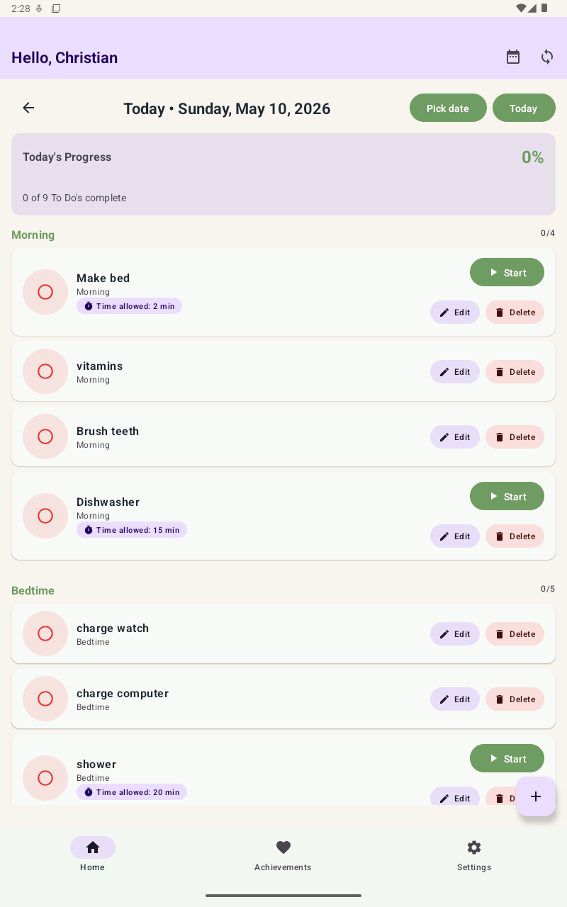
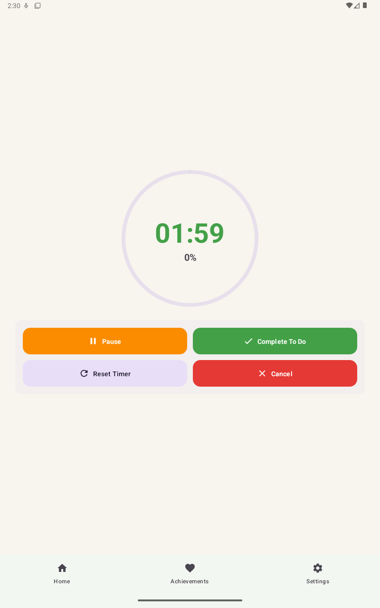
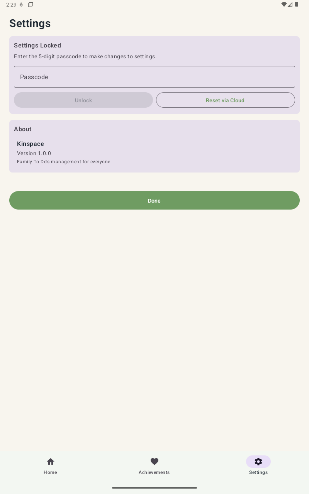

# Kinspace Tablet User Guide

This guide shows the main tablet screens and the most common things a family member will do:

- start with Kinspace sign in and tablet onboarding
- view today's tasks
- move to another day
- complete or uncomplete tasks
- add a new to-do
- start and finish a timer
- review or change settings

## Onboarding and Kinspace Cloud Login

The first launch uses Kinspace Cloud to sign in, then chooses who the tablet belongs to.

- Tap Sign in with Kinspace on the first screen.
- Complete the Kinspace Cloud login in the browser flow.
- If the tablet has not been assigned yet, choose the family member who uses this tablet.
- That selection saves the tablet's member and household so the Home screen can load the right tasks.
- If you ever need to change who the tablet belongs to, Settings can reset the assignment and send you back through setup.

## Home Screen

This is the main screen families use every day.

- The top bar greets the active family member.
- Use the date controls to move between days.
- Tap Pick date to jump directly to any date.
- Tap Today to return to the current day.
- Tap the red circle to mark a to-do complete or uncomplete.
- Tasks with timers show a Start button.
- If editing is enabled in Settings, Edit and Delete buttons appear on the task card.
- Past days are completion-only, so you can review history without changing the task itself.

## Add To Do

Use the Add To Do screen to create a new task for a family member.

- Tap the purple + button on the Home screen to start a new to-do.
- Enter a title first.
- Tap the due date row to open the calendar picker.
- Leave the due date blank if the task should count for today.
- Choose the todo group and repeat options from the native pickers.
- Timer minutes and seconds use native number pickers.
- Minutes and seconds can both be 0.
- Tap Save To Do to save the item and sync it to the cloud.

## Timer Screen

Start a timer when a task has a saved time allowance.

- Tap Start on a task that has a timer.
- Use Pause / Resume to stop and restart the countdown.
- Use Complete To Do to mark the task complete from the timer view.
- Use Reset Timer to restart the timer from the beginning.
- Use Cancel to leave the timer without completing the task.
- When the timer ends, the tablet plays the selected alarm sound and stays on the timer screen until the user leaves it.

## Settings Screen

Settings are protected so changes can be controlled.

- Settings can be locked with a 5-digit passcode.
- If Settings are locked, enter the passcode to unlock them.
- Use Reset via Cloud if the passcode is forgotten.
- The Behavior section controls the daily reset time and auto-logout timeout.
- The edit/delete todo toggle controls whether task cards can be changed or removed.
- After leaving Settings, the passcode lock is restored the next time the screen opens.

## Editing and Deleting To Dos

Turn on the setting first, then use the buttons on each card.

- Open Settings and unlock them first if needed.
- Turn on the Allow edit/delete To Dos setting.
- Go back to Home to see the Edit and Delete buttons on each task card.
- Edit changes the task details and saves the update to the cloud.
- Delete removes the task entirely and syncs the removal to the cloud.
- If the setting is off, the buttons stay hidden.

## Passcode Recovery

If the passcode is forgotten, the tablet can be reset through cloud login.

- Go to Settings.
- Tap Reset via Cloud.
- Sign in to Kinspace Cloud.
- After successful cloud login, set a new 5-digit passcode on the tablet.
- This keeps the tablet protected without losing access permanently.

## Troubleshooting

A few quick fixes for common issues.

- If a new to-do does not appear, tap the refresh icon on Home.
- If the cloud and tablet disagree, refresh Home again after a moment.
- If Settings are locked, use the passcode or Reset via Cloud.
- If a task has no Start button, it does not have a saved timer.
- If you are looking at a previous day, only completion changes are allowed.
